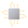

	 

<h3 align="center">OSPedia</h3>
OSPedia aims to be a website that brings out the histories of the notable operating systems of the past and present. It appreciates how far we've come with today's technology, how far we're going with tomorrow's technology, and how these systems helped tremendously.

### Subsites currently in development:  

WinPedia is the subsite for information about Windows. It aims to educate people on the impact of Windows.

MacPedia is the subsite to know macOS. It also aims to educate people about macOS's impact.

### Special mentions:
- The people who voluntarily provide information on Wikipedia are some great humans!
- Thanks drew for refactoring my code!

**Keyboard1000n17**
