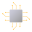

	 

<h3 align="center">OSPedia</h3>
OSPedia aims to be a website that brings out the histories of the notable operating systems of the past and present. It appreciates how far we've come with today's technology, how far we're going with tomorrow's technology, and how these systems helped tremendously.

## Operating systems

The following operating systems are available on our site:

- Windows
- macOS
- Ubuntu

Feel free to add to this list!

## Contributors

<!-- ALL-CONTRIBUTORS-LIST:START - Do not remove or modify this section -->
<!-- prettier-ignore-start -->
<!-- markdownlint-disable -->

<!-- markdownlint-restore -->
<!-- prettier-ignore-end -->

<!-- ALL-CONTRIBUTORS-LIST:END -->

## Contributing

Please do help us in the making of this page! See
[CONTRIBUTING.md](./CONTRIBUTING.md) for more details. This site is not a simple
task. We accumulate information from multiple pages and the information we put
in the articles are carefully chosen and written. Even with pages that use
Wikipedia as the main source, we still modify the content and simplify it. You
don't even need to know HTML to help! The articles are written in Markdown!

## License

This website uses the Creative Commons CC BY-SA 4.0 license. See more in the
[LICENSE](./LICENSE) file.
